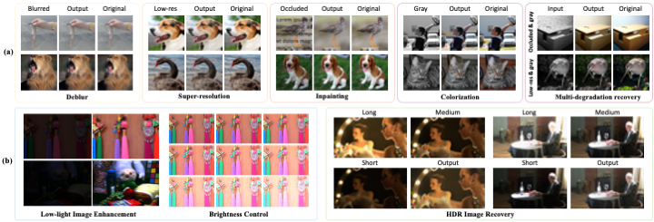

[[Paper]](https://arxiv.org/abs/2304.01247) [[Project Page]](https://generativediffusionprior.github.io/)

This repository contains PyTorch implementation for __Generative Diffusion Prior for Unified Image Restoration and Enhancement__.




This is the repo is based on the open-source repo for [Guided Diffusion](https://github.com/openai/guided-diffusion).
Run the following command the install the guided-diffusion package:
```
pip install -e .
```


# Download Checkpoints and Data

We use a single  single unconditional DDPM pre-trained on ImageNet to produce diverse and high-fidelity outputs for unified image restoration and enhancement. Download pretrained DDPMs on ImageNet-256(uncond) from [this page](https://github.com/openai/guided-diffusion). 
Then download pre-generated ImageNet-64 (BigGAN-deep),  LSUN-Bedroom (StyleGAN) and LSUN-Cat (StyleGAN2) images from this page [this page](https://github.com/openai/guided-diffusion/tree/main/evaluations).

We use 1,000 images from the ImageNet validation set for comparison with other methods. The list of images is taken from [https://github.com/XingangPan/deep-generative-prior/](https://github.com/XingangPan/deep-generative-prior/)

## Generative Diffusion Prior (GDP-x0) for linear problems

```
cd scripts
```

 * Super-resolution:
```
MODEL_FLAGS="--attention_resolutions 32,16,8 --class_cond False --diffusion_steps 1000 --image_size 256 --learn_sigma True --noise_schedule linear --num_channels 256 --num_head_channels 64 --num_res_blocks 2 --resblock_updown True --use_fp16 True --use_scale_shift_norm True"
python sample_x0_sr4.py  $MODEL_FLAGS --use_img_for_guidance --start_from_scratch --save_png_files
```
 * Deblurring:
```
MODEL_FLAGS="--attention_resolutions 32,16,8 --class_cond False --diffusion_steps 1000 --image_size 256 --learn_sigma True --noise_schedule linear --num_channels 256 --num_head_channels 64 --num_res_blocks 2 --resblock_updown True --use_fp16 True --use_scale_shift_norm True"
python sample_x0_blur.py  $MODEL_FLAGS --use_img_for_guidance --start_from_scratch --save_png_files
```
 * Impainting:
```
MODEL_FLAGS="--attention_resolutions 32,16,8 --class_cond False --diffusion_steps 1000 --image_size 256 --learn_sigma True --noise_schedule linear --num_channels 256 --num_head_channels 64 --num_res_blocks 2 --resblock_updown True --use_fp16 True --use_scale_shift_norm True"
python sample_x0_linear.py  $MODEL_FLAGS --deg inp25 --use_img_for_guidance --start_from_scratch --save_png_files
```
 * Colorization:
```
MODEL_FLAGS="--attention_resolutions 32,16,8 --class_cond False --diffusion_steps 1000 --image_size 256 --learn_sigma True --noise_schedule linear --num_channels 256 --num_head_channels 64 --num_res_blocks 2 --resblock_updown True --use_fp16 True --use_scale_shift_norm True"
python sample_x0_color.py  $MODEL_FLAGS --use_img_for_guidance --start_from_scratch --save_png_files
```

<!-- 
 * Super-resolution with 20-step DDIM:
```
MODEL_FLAGS="--attention_resolutions 32,16,8 --class_cond False --diffusion_steps 1000 --image_size 256 --learn_sigma True --noise_schedule linear --num_channels 256 --num_head_channels 64 --num_res_blocks 2 --resblock_updown True --use_fp16 True --use_scale_shift_norm True"
SAMPLE_FLAGS="--batch_size 1 --num_samples 100  --timestep_respacing ddim20 --use_ddim True"
python sample_x0_linear.py  $MODEL_FLAGS --deg sr4 --use_img_for_guidance --start_from_scratch --save_png_files
``` -->
## Generative Diffusion Prior (GDP) for non-linear, blind, multi-guidance problems

 * Low light enhancement:
```
MODEL_FLAGS="--attention_resolutions 32,16,8 --class_cond False --diffusion_steps 1000 --image_size 256 --learn_sigma True --noise_schedule linear --num_channels 256 --num_head_channels 64 --num_res_blocks 2 --resblock_updown True --use_fp16 True --use_scale_shift_norm True"
python sample_x0_enhancement_low_light.py  $MODEL_FLAGS --use_img_for_guidance --start_from_scratch --save_png_files
```
 * HDR recovery:
```
MODEL_FLAGS="--attention_resolutions 32,16,8 --class_cond False --diffusion_steps 1000 --image_size 256 --learn_sigma True --noise_schedule linear --num_channels 256 --num_head_channels 64 --num_res_blocks 2 --resblock_updown True --use_fp16 True --use_scale_shift_norm True"
python sample_x0_enhancement_HDR.py  $MODEL_FLAGS --use_img_for_guidance --start_from_scratch --save_png_files
```
 <!-- The code for HDR recovery will come soon! -->

<!-- 
Run the following command to use ES-DDPM (T'=100) to generate ImageNet-64 images (with jumping interval 4):
```
python generate_processes_diffusion_and_reverse --execute --reverse_steps 25 --chain_length 250 --dataset imagenet --dataset_path ../evaluations/precomputed/biggan_deep_trunc1_imagenet256.npz --devices '0,1,2,3,4,5,6,7,8' 
```

Run the following command to use ES-DDPM (T'=100) to generate LSUN-Bedroom-256 images:
```
python generate_processes_diffusion_and_reverse --execute --reverse_steps 100 --chain_length 1000 --dataset lsun_bedroom --dataset_path ../evaluations/precomputed/lsun/stylegan_lsun_bedroom.npz --devices '0,1,2,3,4,5,6,7,8' 
```

Run the following command to use ES-DDPM (T'=100) to generate LSUN-Cat-256 images:
```
python generate_processes_diffusion_and_reverse --execute --reverse_steps 100 --chain_length 1000 --dataset lsun_cat --dataset_path ../evaluations/precomputed/lsun/stylegan2_lsun_cat.npz --devices '0,1,2,3,4,5,6,7,8' 
``` -->
## Generative Diffusion Prior (GDP-xt) for linear problems

```
cd scripts
```

 * Super-resolution:
```
MODEL_FLAGS="--attention_resolutions 32,16,8 --class_cond False --diffusion_steps 1000 --image_size 256 --learn_sigma True --noise_schedule linear --num_channels 256 --num_head_channels 64 --num_res_blocks 2 --resblock_updown True --use_fp16 True --use_scale_shift_norm True"
python sample_sr4.py  $MODEL_FLAGS --use_img_for_guidance --start_from_scratch --save_png_files
```
 * Deblurring:
```
MODEL_FLAGS="--attention_resolutions 32,16,8 --class_cond False --diffusion_steps 1000 --image_size 256 --learn_sigma True --noise_schedule linear --num_channels 256 --num_head_channels 64 --num_res_blocks 2 --resblock_updown True --use_fp16 True --use_scale_shift_norm True"
python sample_blur.py  $MODEL_FLAGS --use_img_for_guidance --start_from_scratch --save_png_files
```
 * Impainting:
```
MODEL_FLAGS="--attention_resolutions 32,16,8 --class_cond False --diffusion_steps 1000 --image_size 256 --learn_sigma True --noise_schedule linear --num_channels 256 --num_head_channels 64 --num_res_blocks 2 --resblock_updown True --use_fp16 True --use_scale_shift_norm True"
python sample_inp.py  $MODEL_FLAGS --deg inp25 --use_img_for_guidance --start_from_scratch --save_png_files
```
 * Colorization:
```
MODEL_FLAGS="--attention_resolutions 32,16,8 --class_cond False --diffusion_steps 1000 --image_size 256 --learn_sigma True --noise_schedule linear --num_channels 256 --num_head_channels 64 --num_res_blocks 2 --resblock_updown True --use_fp16 True --use_scale_shift_norm True"
python sample_color.py  $MODEL_FLAGS --use_img_for_guidance --start_from_scratch --save_png_files
```

## Generative Diffusion Prior (GDP-x0-v1) for linear problems

```
cd scripts
```

 * Super-resolution:
```
MODEL_FLAGS="--attention_resolutions 32,16,8 --class_cond False --diffusion_steps 1000 --image_size 256 --learn_sigma True --noise_schedule linear --num_channels 256 --num_head_channels 64 --num_res_blocks 2 --resblock_updown True --use_fp16 True --use_scale_shift_norm True"
python sample_x0_sr4_v1.py  $MODEL_FLAGS --use_img_for_guidance --start_from_scratch --save_png_files
```
 * Deblurring:
```
MODEL_FLAGS="--attention_resolutions 32,16,8 --class_cond False --diffusion_steps 1000 --image_size 256 --learn_sigma True --noise_schedule linear --num_channels 256 --num_head_channels 64 --num_res_blocks 2 --resblock_updown True --use_fp16 True --use_scale_shift_norm True"
python sample_x0_blur_v1.py  $MODEL_FLAGS --use_img_for_guidance --start_from_scratch --save_png_files
```
 * Impainting:
```
MODEL_FLAGS="--attention_resolutions 32,16,8 --class_cond False --diffusion_steps 1000 --image_size 256 --learn_sigma True --noise_schedule linear --num_channels 256 --num_head_channels 64 --num_res_blocks 2 --resblock_updown True --use_fp16 True --use_scale_shift_norm True"
python sample_x0_inp_v1.py  $MODEL_FLAGS --deg inp25 --use_img_for_guidance --start_from_scratch --save_png_files
```
 * Colorization:
```
MODEL_FLAGS="--attention_resolutions 32,16,8 --class_cond False --diffusion_steps 1000 --image_size 256 --learn_sigma True --noise_schedule linear --num_channels 256 --num_head_channels 64 --num_res_blocks 2 --resblock_updown True --use_fp16 True --use_scale_shift_norm True"
python sample_x0_color_v1.py  $MODEL_FLAGS --use_img_for_guidance --start_from_scratch --save_png_files
```

## References and Acknowledgements
```
@inproceedings{fei2022generative,
    title={Generative Diffusion Prior for Unified Image Restoration and Enhancement},
    author={Ben Fei, Zhaoyang Lyu, Liang Pan, Junzhe Zhang, Weidong Yang, Tianyue Luo, Bo Zhang, Bo Dai},
    booktitle={Proceedings of the IEEE Conference on Computer Vision and Pattern Recognition (CVPR)},
    year={2023}
}
```

This implementation is based on / inspired by:
- [https://github.com/openai/guided-diffusion](https://github.com/openai/guided-diffusion) (the Guided Diffusion repo),
- [https://github.com/bahjat-kawar/ddrm](https://github.com/bahjat-kawar/ddrm) (the DDRM repo), and
- [https://github.com/ZhaoyangLyu/Early_Stopped_DDPM](https://github.com/ZhaoyangLyu/Early_Stopped_DDPM) (the Early_Stopped_DDPM repo)